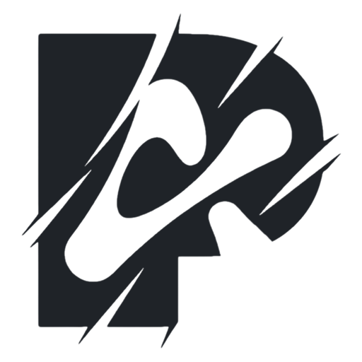
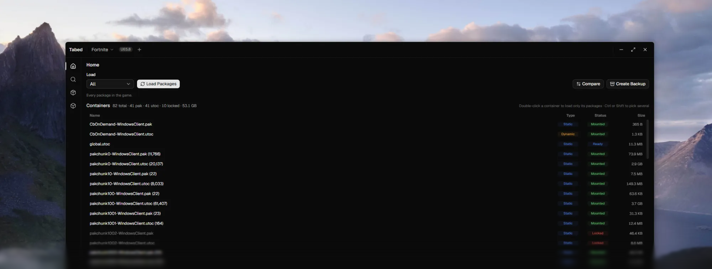

<picture>
  <source media="(prefers-color-scheme: dark)" srcset="assets/logo-dark.png">
  
</picture>

# Tabed

**An Unreal Engine asset browser for Windows.**

 

 

## Download

`Tabed.exe` from the [latest release](https://github.com/ponydeerr/Tabed/releases/latest).
One file, no installer, .NET included.

Needs 64-bit Windows 10 or 11 and the WebView2 Runtime, which Windows 11 ships and
any PC with Edge already has.

## What it does

- Loads `.pak`, `.utoc` and `.ucas` containers, all of them or one at a time
- Sets Fortnite up by itself, keys and mappings included, and can mount the live
  build without the game installed
- Searches package paths, or the names items go by in game
- Shows properties as JSON with a find bar, clickable references and a dependency panel
- Previews meshes, animations, textures, audio, fonts and cosmetic item cards
- Exports raw, JSON, PNG, WAV, meshes and animations, with a queue
- Diffs an `.fbkp` backup against whatever is mounted now
- Themes, accent colours, density, favourite folders, Discord Rich Presence

## Getting started

1. Run `Tabed.exe`.
2. Pick a game folder. Fortnite is found for you; other games need a name, an engine
   version and a directory.
3. Press **Load Packages**, then search or browse.

Dragging a `.pak`, `.utoc` or `.fbkp` onto the window opens it straight away.

## Shortcuts

| Shortcut | Does |
|---|---|
| <kbd>Ctrl</kbd> <kbd>K</kbd> | Command palette |
| <kbd>Ctrl</kbd> <kbd>F</kbd> | Find in the open file |
| <kbd>F3</kbd> · <kbd>Enter</kbd> | Next match |
| <kbd>Shift</kbd> <kbd>F3</kbd> · <kbd>Shift</kbd> <kbd>Enter</kbd> | Previous match |
| <kbd>Esc</kbd> | Close the find bar |
| Double-click a container | Load only that container |
| <kbd>Ctrl</kbd> · <kbd>Shift</kbd> + click | Pick several containers |

## Files

Settings, backups and exports go to `%LOCALAPPDATA%\Tabed Data`. Nothing is written
to the game folder.

## Built with

[CUE4Parse](https://github.com/FabianFG/CUE4Parse), .NET, WPF, WebView2, React and
three.js.
